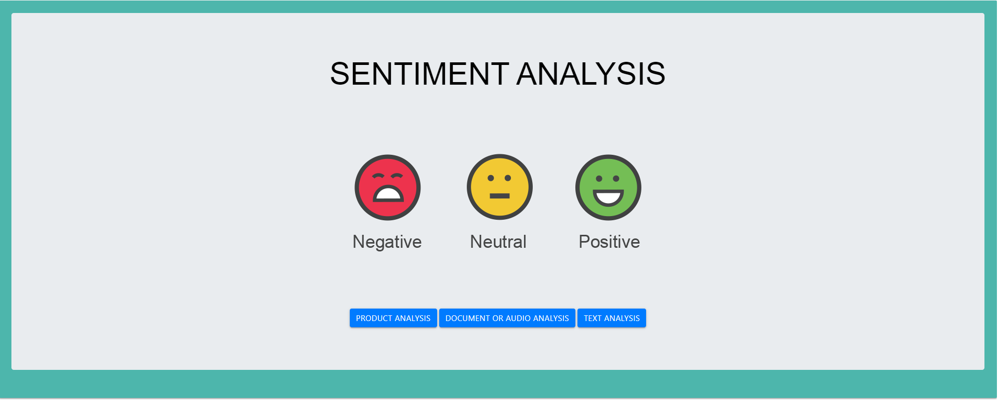
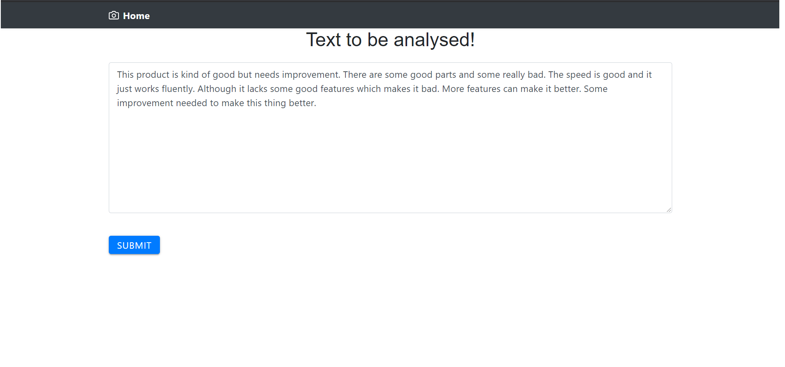
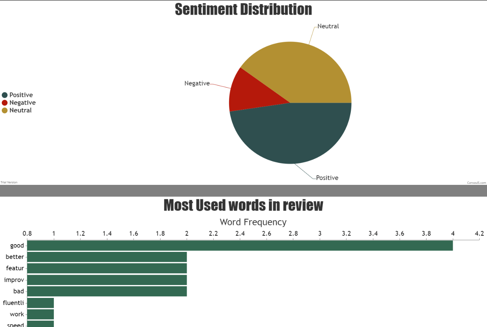

# SE Project 1

# C.E.L.T: The Sentimental Analyser

### YouTube Link:

## INTRODUCTION

Sentiment analysis is one of the fastest growing research areas in computer science, making it challenging to keep track of all the activities in the area. In our project we aim to achieve our goal in accurately predicting a users sentiment by analysing the data provided in any of the four different methods. They are Document Analysis, Text Analysis, Product Analysis and Audio Analysis. This project though currently in the initial stages of development, can be further applied to numerous domains which can be useful for the society. This document provides a major perspective for the users to understand and take up the project as an Open source software and add on multiple features before releasing to the market. Also, the document aids the developers in understanding the code and acts as a reference point for starting the project.

## Technologies and Tools
<b>Language</b>: Python 3, HTML, CSS

<b>Framework</b>: Scrappy (Web-crawling)

<b>Tool</b>: Vader Analysis Tool

<b>Web Application Framework</b>: Django (Model-template-views architectural pattern)

<b>Test Framework</b>: pytest

<b>Database</b>: SQLite

<b>Tools</b>: Visual Studio Code

<b>Syntax Checker & Sytle Checker</b>: pylint (VSCode Python v2020.8.109390 Extension)

<b>Code Formatter</b>: autopep8 (VSCode Python-autopep8 v1.0.2)

<b>Version Control</b>: git

## Steps for execution
1. Run `pip install -r requirements.txt` followed by `python -c "import nltk; nltk.download('punkt'); nltk.download('stopwords')"`
2. Make sure you change the directory to <b>sentimental_analysis</b>
3. Execute manage.py using the command `python3 manage.py runserver` at `/SE_Project1/sentimental_analaysis`. This runs the Django server such that we can open the webUI for the project on the browser.
4. Next, open your browser and type in `localhost:8000` in the search bar to open the webUI of the application.
5. The UI typically looks as shown below and here you have a choice between URL, file or normal text input.
## Steps for testing
1. Run `pip install -r requirements.txt` followed by `python -c "import nltk; nltk.download('punkt'); nltk.download('stopwords')"`
2. Make sure you change the directory to <b>sentimental_analysis</b>
3. Execute manage.py using the command `python3 manage.py test` at `/SE_Project1/sentimental_analaysis`. This runs the unit test functions in all test named files.  
Homepage UI:  

The UI for text input is as shown below:

The UI for Result graphs is as shown below:

## FUTURE SCOPE

Implement user authentication to store history for each user.

Recommendation system based on analysis results.

Live speech to text sentiment analysis.

Enhance the analysis by taking into consideration the number of users rated for each product!

Extend the analysis to the Facebook, Twitter and LinkedIn Posts

## Team Members

Mangalnathan Vijayagopal (mvijaya2)

Nischal Badarinath Kashyap (nkashya)

Amogh Rameshappa Devapura (arames22)

Niranjan Pandeshwar (nrpandes)

Sharath Bangalore Ramesh Kumar (sbangal2)
